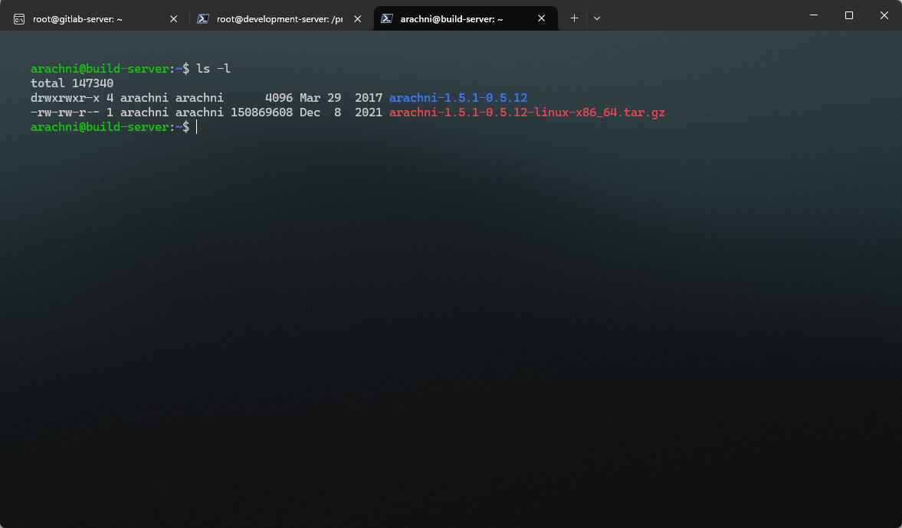
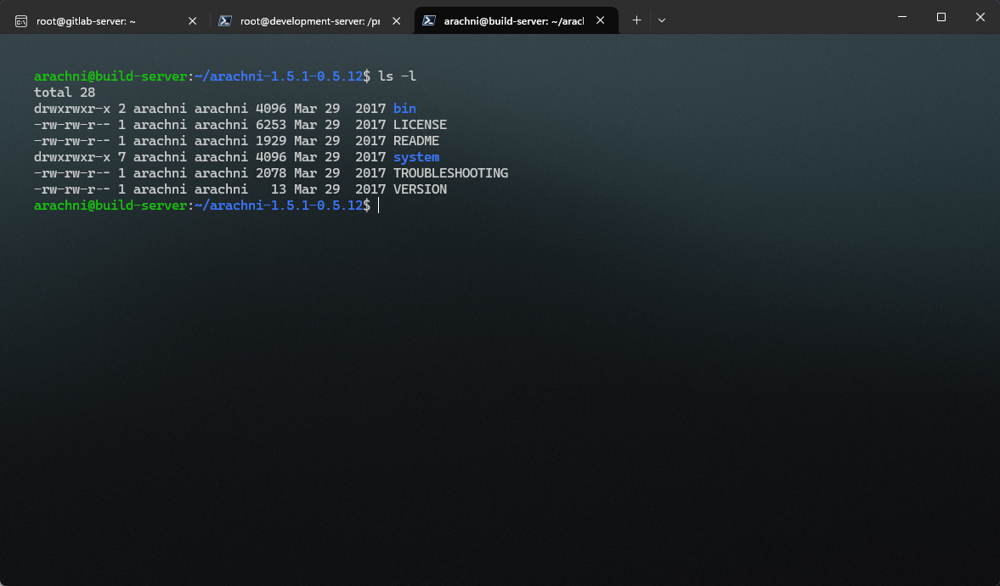
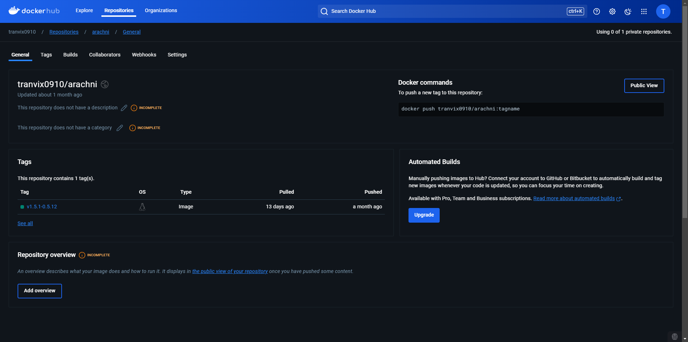

#### Web Application Security Scan với Arachni

Sau khi dự án được Deploy thành công chúng ta có thể tiến hành quét bảo mật của Web.

Cài đặt **Arachni** ở **Server Build** vì Server Build dùng để Deploy dự án:

Tạo User cho Arachni.
```
adduser arachni
```
Tải và giải nén file cài đặt Arachni.
```
wget https://github.com/Arachni/arachni/releases/download/v1.5.1/arachni-1.5.1-0.5.12-linux-x86_64.tar.gz

tar -xvf arachni-1.5.1-0.5.12-linux-x86_64.tar.gz
```


Di chuyển vào thư mục vừa giải nén.



Thư mục `bin` là thư mục chứa các câu lệnh, có thể chạy lệnh thông qua thư mục `bin`.

Có thể chạy lệnh sau để quét một trang Web bạn đã Deploy.
```
bin/arachni --output-verbose --scope-include-subdomains http://<your-ip>:<port> --report-save-path=/tmp/<name-file>.afr
```
- `http://<your-ip>:<port>` : Là địa chỉ của Web.

- Kết quả quét sẽ được lưu trong tệp `<name-file>.afr`.

- `Arachni Framework Report (.afr)` là định dạng của file Report.

Có thể chuyển thành file HTML bằng lệnh:
```
bin/arachni_reporter /tmp/wineapp-frontend.afr --reporter=html:outfile=<name-file>.html.zip
```
```
arachni@database-build-server:~/arachni-1.5.1-0.5.12$ bin/arachni_reporter /tmp/wineapp-frontend.afr --reporter=html:outfile=wineapp-backend.html.zip
Arachni - Web Application Security Scanner Framework v1.5.1
   Author: Tasos "Zapotek" Laskos <tasos.laskos@arachni-scanner.com>

           (With the support of the community and the Arachni Team.)

   Website:       http://arachni-scanner.com
   Documentation: http://arachni-scanner.com/wiki


 [*] HTML: Creating HTML report...
 [*] HTML: Saved in 'wineapp-backend.html.zip'.
arachni@database-build-server:~/arachni-1.5.1-0.5.12$ ls -l
total 904
drwxrwxr-x 2 arachni arachni   4096 Mar 29  2017 bin
-rw-rw-r-- 1 arachni arachni   6253 Mar 29  2017 LICENSE
-rw-rw-r-- 1 arachni arachni 893570 Jul 21 15:24 wineapp-backend.html.zip    <-----------------------------
-rw-rw-r-- 1 arachni arachni   1929 Mar 29  2017 README
drwxrwxr-x 7 arachni arachni   4096 Mar 29  2017 system
-rw-rw-r-- 1 arachni arachni   2078 Mar 29  2017 TROUBLESHOOTING
-rw-rw-r-- 1 arachni arachni     13 Mar 29  2017 VERSION
```

#### Tạo Dockerfile Arachni

```Dockerfile
## Tools: Arachni
## OS: Ubuntu
## Version: v1
FROM ubuntu:latest

RUN apt update -y && \
    apt install -y wget tar && \
    rm -rf /var/lib/apt/lists/*
RUN wget https://github.com/Arachni/arachni/releases/download/v1.5.1/arachni-1.5.1-0.5.12-linux-x86_64.tar.gz && \
    tar -xvf arachni-1.5.1-0.5.12-linux-x86_64.tar.gz && \
    rm arachni-1.5.1-0.5.12-linux-x86_64.tar.gz

WORKDIR /arachni-1.5.1-0.5.12

CMD ["bin/arachni"]
```

Build Image.

```shell
docker build -t tranvi0910/arachni:v1.5.1-0.5.12 .
```

Tiếp theo tiến hành đang nhập và push vào Dockerhub, khi chúng ta thực hiện quá trình CI/CD chỉ cần kéo Image về và thực hiện việc Test.
```
docker login

docker push tranvi0910/arachni:v1.5.1-0.5.12
```


Việc thiết lập và cài đặt Arachni đã hoàn thành.


