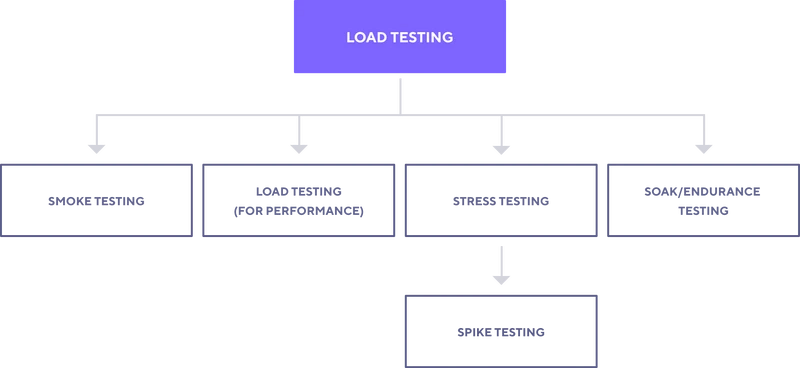

#### Cài đặt k6
Tạo file shell script để cài đặt k6 ở Server **Build**.
```bash
#!/bin/bash
sudo gpg -k
sudo gpg --no-default-keyring --keyring /usr/share/keyrings/k6-archive-keyring.gpg --keyserver hkp://keyserver.ubuntu.com:80 --recv-keys C5AD17C747E3415A3642D57D77C6C491D6AC1D69
echo "deb [signed-by=/usr/share/keyrings/k6-archive-keyring.gpg] https://dl.k6.io/deb stable main" | sudo tee /etc/apt/sources.list.d/k6.list
sudo apt-get update
sudo apt-get install k6
```
Tiến hành cài đặt.
```
sh install-k6.sh
```

#### Các loại Performance Testing
Trước khi sử dụng k6, trước tiên chúng ta hãy hiểu định nghĩa và sự khác biệt của các loại Performance Testing này.

1. **Load Testing (Kiểm thử tải)**:

    - Đây là quá trình kiểm tra phần mềm bằng cách áp dụng tải lớn mục đích đo lường và đánh giá các yếu tố như thời gian đáp ứng, tài nguyên tiêu tốn của hệ thống, sự ổn định của hệ thống dưới tải cao.

2. **Smoke Testing**:

    - Kiểm thử này nhằm xác định liệu phiên bản phần mềm có thể khởi chạy và hoạt động bình thường với các chức năng cơ bản nhất hay không. 
    
    - Đây là bước kiểm thử ban đầu để quyết định xem phần mềm có đủ ổn định để thực hiện các kiểm thử chi tiết hơn.

3. **Load Testing (for Performance)**:

    - Tập trung vào việc đánh giá hiệu suất của hệ thống dưới tải trọng cụ thể để đảm bảo hệ thống đáp ứng yêu cầu về hiệu suất như thời gian phản hồi và xử lý yêu cầu trong giới hạn cho phép.

4. **Stress Testing**:

    - Kiểm thử này nhằm xác định giới hạn của hệ thống bằng cách áp dụng tải cao hơn so với tải dự kiến, tăng dần và giảm dần số lượng người dùng qua các mức để kiểm tra.
    
    - Mục đích là để tìm ra điểm gãy của hệ thống, từ đó có thể tối ưu hóa và chuẩn bị cho các tình huống tải cao đột ngột.

5. **Spike Testing**:

    - Một dạng cụ thể của Stress Testing, kiểm thử này mô phỏng các tình huống tải tăng đột ngột trong một khoảng thời gian ngắn để đánh giá khả năng của hệ thống trong việc xử lý các biến động tải đột ngột.

6. **Soak/Endurance Testing**:

    - Kiểm thử này đánh giá hiệu suất của hệ thống dưới tải trọng trong một khoảng thời gian dài để xác định các vấn đề tiềm ẩn liên quan đến hiệu suất dài hạn như rò rỉ bộ nhớ hoặc suy giảm hiệu suất theo thời gian.

#### Thiết lập k6 Test
Ví dụ chúng ta sẽ tạo một file `load-test.js` và tiến hành test.
```js
import http from 'k6/http';
import { check, sleep } from 'k6';

export let options = {
        vus: 100,
        duration: '10s',
        thresholds: {
                http_req_duration: ['p(95)<500'] // 95% request dưới 500ms
        }
};

export default function () {
        const BASE_URL = 'http://192.168.181.104:3000/';
        let res = http.get(BASE_URL);
        check(res, {
                'status was 200': (r) => r.status === 200,
        });
        sleep(1);
}
```
Output
```
root@build-server:/tools/k6# k6 run load-test.js

          /\      |‾‾| /‾‾/   /‾‾/
     /\  /  \     |  |/  /   /  /
    /  \/    \    |     (   /   ‾‾\
   /          \   |  |\  \ |  (‾)  |
  / __________ \  |__| \__\ \_____/ .io

     execution: local
        script: load-test.js
        output: -

     scenarios: (100.00%) 1 scenario, 100 max VUs, 40s max duration (incl. graceful stop):
              * default: 100 looping VUs for 10s (gracefulStop: 30s)


     ✓ status was 200

     checks.........................: 100.00% ✓ 811       ✗ 0
     data_received..................: 781 kB  71 kB/s
     data_sent......................: 70 kB   6.4 kB/s
     http_req_blocked...............: avg=14.71ms  min=30.3µs   med=44.3µs   max=433.35ms p(90)=64.81ms  p(95)=105.95ms
     http_req_connecting............: avg=10.95ms  min=0s       med=0s       max=188.22ms p(90)=52.37ms  p(95)=95.06ms
   ✓ http_req_duration..............: avg=202.57ms min=2.04ms   med=200.53ms max=508.74ms p(90)=337.88ms p(95)=384.15ms
       { expected_response:true }...: avg=202.57ms min=2.04ms   med=200.53ms max=508.74ms p(90)=337.88ms p(95)=384.15ms
     http_req_failed................: 0.00%   ✓ 0         ✗ 811
     http_req_receiving.............: avg=1.67ms   min=85.7µs   med=150.2µs  max=120.63ms p(90)=1.18ms   p(95)=4.52ms
     http_req_sending...............: avg=31.14ms  min=40µs     med=69.8µs   max=354.27ms p(90)=117.14ms p(95)=148.13ms
     http_req_tls_handshaking.......: avg=0s       min=0s       med=0s       max=0s       p(90)=0s       p(95)=0s
     http_req_waiting...............: avg=169.76ms min=921.41µs med=151.78ms max=440.52ms p(90)=300.11ms p(95)=334.18ms
     http_reqs......................: 811     73.898412/s
     iteration_duration.............: avg=1.29s    min=1s       med=1.29s    max=1.68s    p(90)=1.46s    p(95)=1.5s
     iterations.....................: 811     73.898412/s
     vus............................: 2       min=2       max=100
     vus_max........................: 100     min=100     max=100


running (11.0s), 000/100 VUs, 811 complete and 0 interrupted iterations
default ✓ [======================================] 100 VUs  10s
```

**data_received**:

- Tổng số dữ liệu nhận được từ máy chủ qua các yêu cầu HTTP trong suốt quá trình kiểm thử.

**data_sent**:

- Tổng số dữ liệu đã gửi đi từ client đến máy chủ qua các yêu cầu HTTP trong suốt quá trình kiểm thử.

**http_req_blocked**:

- Thời gian bị chặn trước khi yêu cầu HTTP được gửi đi (có thể do giới hạn băng thông, hạn chế tài nguyên...).

- Cho biết thời gian request phải chờ đợi trước khi được xử lý.

**http_req_connecting**:

- Thời gian kết nối với máy chủ sau khi gửi request.

**http_req_duration**:

- Thời gian hoàn thành toàn bộ yêu cầu HTTP, từ lúc bắt đầu đến khi hoàn thành toàn bộ phản hồi.

**http_req_failed**:

- Số lượng yêu cầu HTTP thất bại (có thể do lỗi mạng, lỗi máy chủ...).

**http_req_receiving**:
    
- Thời gian nhận dữ liệu từ máy chủ sau khi yêu cầu HTTP đã được gửi đi.

**http_req_sending**:
    
- Thời gian gửi dữ liệu yêu cầu đến máy chủ ( client -> server ).

**http_req_tls_handshaking**:

- Thời gian thiết lập kết nối an toàn (SSL)
    
- Thời gian thực hiện bắt tay (handshake) TLS cho kết nối HTTPS.

**http_req_waiting**:
    
- Thời gian chờ đợi phản hồi từ máy chủ sau khi gửi yêu cầu HTTP.

**http_reqs**:

- Tổng số lượng yêu cầu HTTP đã được thực hiện.

**iteration_duration**:

- Thời gian thực hiện một vòng lặp (iteration) của kịch bản kiểm thử.

**iterations**:
    
- Tổng số vòng lặp (iterations) đã được thực hiện trong kịch bản kiểm thử.

**vus**:

- Số lượng người dùng ảo (Virtual Users) hiện tại đang thực hiện kiểm thử.

**vus_max**:

- Số lượng người dùng ảo tối đa trong quá trình kiểm thử.

Như vậy chúng ta đã cài đặt thành công k6 và thực hiện test cơ bản.